# License

Security-components source code files are made avaialable under the Apache License, Version 2.0 (Apache-2.0), located into the LICENSE file.

# README

This project contains different components to deploy the Security enabler.

The purposes of this enabler, related to Master-Controller's interactions, are: 
- to provide a secure communication
- to control the access of the registered users to the resources offered in Master-Controller's API. 


# Introduction

Security components offer a Distributed Capability-Based Access Control (DCapBAC) technology by using both an XACML framework, and a Capability Manager. Capability Manager component issues authorizations tokens which must be included in the requests aimed at the Master-Controller's API.

These components offer the necessary functionality to support the authentication and authorization processes. In this sense, for the authentication side, the considered component is "IdM-Keyrock", for the authorization one the considered components are "XACML-PAP-PDP", "Capability Manager" and "PEP-Proxy".

Remembering DCapBAC technology, where access control process is decoupled in two phases:

- 1st operation to receive authorisation. A token is issued
- 2nd operation access to the resource previously validating the token.

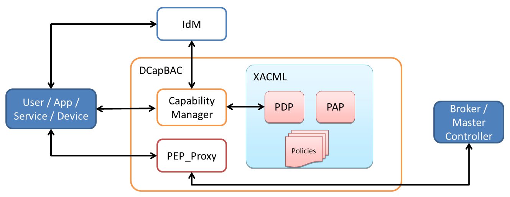

## IdM-Keyrock

Keyrock is the FIWARE component responsible for Identity Management. Using Keyrock (in conjunction with other security components such as PEP Proxy and Authzforce) enables you to add OAuth2-based authentication and authorization security to your services and applications.

With IdM-Keyrock component the authentication step is covered.

Further information can be found in the [IdM-Keyrock documentation](https://fiware-idm.readthedocs.io/en/latest/index.html).


## XACML-PAP-PDP

This element corresponds to the implementation of the XACML framework. It comprises:
- a Policy Administration Point (PAP) which is responsible for managing the authorisation policies through a GUI for managing the XACML policies which must be defined according to a triplet (subject, resource, action).
- a Policy Decision Point (PDP), responsible for issuing possitive/negativer verdicts whenever an authorisation request is received. 

This project is developed in Java and it's a DCapBAC component.

XACML-PDP is the component that validates the authorization request inside the first phase of the access control process of DCapBAC.

## Capability Manager

This component is the contact point for services and users that intend to access the resources offered by the Master-Controller's API. In this sense, it provides a REST API for receiving authorisation queries.

Capability Manager is developed in Python and makes use of the functionality developed in Java (.jar file), and it's a DCapBAC component as we can see in the image of the Introduction section.

Regarding DCapBAC technology, remembered in the Introduction section too, Capability Manager covers the first phase of the access control process (receive authorisation).

## PEP-Proxy

PEP-Proxy is the component responsible for receiving the queries aimed to access to a resource, they are accompanied by the corresponding `Capability Token` and forwards requests to the corresponding endpoint (Master-Controller's API) and the responses back to the requester.

PEP-Proxy is developed in Python and makes use of the functionality developed in Java (.jar file), and it's a DCapBAC component as we can see in the image of the Introduction section.

Regarding DCapBAC technology, remembered in the Introduction section too, PEP-Proxy covers the second phase of the access control process (access to the resourde).

# Security Components integration/functionality

This section explains the interaction between all the security components and the integration with Master-Controller component. In this sense, it details the corresponding API of each component and the sequence of the resulting accesses.
## IdM-Keyrock

IdM-Keyrock provides a REST API for receiving authentication queries. When an authentication request is received, the component recovers user credentials from the JSON body request and returns an IdM token if it's the case. This token will be required by authorisation process (through Capability Manager).

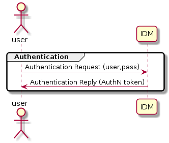

Resources can be managed through the API (e.g. Users, applications and organizations). One of the main uses of IdM-Keyrock is to allow developers to add identity management (authentication and authorization) to their applications based on FIWARE identity. This is possible thanks to OAuth2 protocol. 

Further information can be found in the [Keyrock Apiary](https://keyrock.docs.apiary.io/#).


## XACML-PAP-PDP

XACML-PAP is a GUI for managing XACML policies (configuration), it's not interfering in the obtaining authorisation requests verdict.

XACML-PDP returns the verdict when an authorisation request is received from Capability Manager, it recovers from the body:

- the subject and subjectType of the resource’s request .
- the resource: endpoint (protocol+IP+PORT) + path of the resource’s request 
- the action: method of the resource’s request ("POST", "GET", "PATCH", "DELETE")

With this information, XACML-PDP accesses to the XACML policies for validating authorisation requests and obtain if the subject can access to a resource and can perform the action over the resource (verdict). 

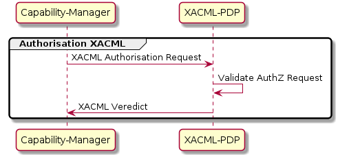

XAML-PDP component offers the next endpoint in order to Obtain Verdict `POST /XACMLServletPDP/`. The next sentence shows the format of the request.

```sh
curl --location --request POST 'http://{XACML-PDP-IP}:{XACML-PDP-Port}/XACMLServletPDP/' \
   --header 'Content-Type: text/plain' \
   --data-raw '<Request xmlns="urn:oasis:names:tc:xacml:2.0:context:schema:os">
   <Subject SubjectCategory="urn:oasis:names:tc:xacml:1.0:subject-category:access-subject">
       <Attribute AttributeId=subjectType DataType="http://www.w3.org/2001/XMLSchema#string">
           <AttributeValue>subject</AttributeValue>
       </Attribute>  
   </Subject>
   
   <Resource>
       <Attribute AttributeId="urn:oasis:names:tc:xacml:1.0:resource:resource-id" DataType="http://www.w3.org/2001/XMLSchema#string">
           <AttributeValue>resource</AttributeValue>
       </Attribute>
   </Resource> 

   <Action>
       <Attribute AttributeId="urn:oasis:names:tc:xacml:1.0:action:action-id" DataType="http://www.w3.org/2001/XMLSchema#string">
           <AttributeValue>action</AttributeValue>
       </Attribute>  
   </Action>

   <Environment/>
</Request>'
```

Replace `subjectType`, `subject`, `resource` and `action` with the correct values. It depends of XACML policies defined in XAMCL-PAP.

Regarding the response, there are three possible verdicts (Permit,
NotApplicable, Deny) all of them with 200 - OK status code response. The next sentences show the format of the different responses.

```
<Response>
  <Result ResourceID="resource">
    <Decision>Permit</Decision>
    <Status>
      <StatusCode Value="urn:oasis:names:tc:xacml:1.0:status:ok"/>
    </Status>
    <Obligations>
      <Obligation ObligationId="liveTime" FulfillOn="Permit">
      </Obligation>
    </Obligations>
  </Result>
</Response>
```

```
<Response>
  <Result ResourceID="resource">
    <Decision>NotApplicable</Decision>
    <Status>
      <StatusCode Value="urn:oasis:names:tc:xacml:1.0:status:ok"/>
    </Status>
  </Result>
</Response>
```

```
<Response>
  <Result ResourceID="resource">
    <Decision>Deny</Decision>
    <Status>
      <StatusCode Value="urn:oasis:names:tc:xacml:1.0:status:ok"/>
    </Status>
  </Result>
</Response>
```

## Capability Manager

This component provides a REST API for receiving authorisation queries, which are tailored and forwarded to the XACML PDP for a verdict.

When an authorisation request is received by Capability Manager, it recovers from the JSON body:

- an authentication token which proceeds from authentication phase (access to IdM-Keyrock).
- an endpoint of the resource’s request (protocol+IP+PORT). In DCapBAC scenario, it corresponds with PEP-Proxy component.
- the action/method of the resource’s request (“POST”, “GET”, “PATCH”...)
- the path of the resource’s request

With this information, Capability Manager:

- Access to authentication component (IdM-Keyrock) to validate authentication token.
- Access to XACML framework for validating authorisation requests (through PDP) and obtain if the subject can access to a resource and can perform the action over the resource (verdict). 
- If a positive verdict is received, finally, the Capability Manager issues an authorisation token called Capability Token which is a signed JSON document which contains all the required information for the authorisation, such as the resource to be accessed, the action to be performed, and also a time interval during the Capability Token is valid. This token will be required to access to the resource (through PEP-Proxy).

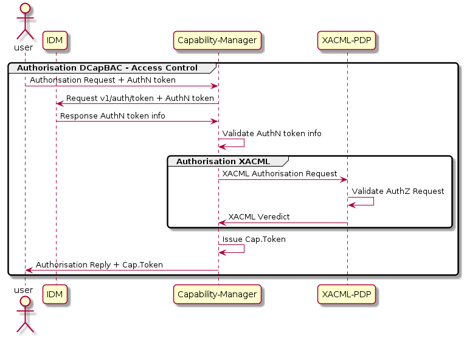

Capability Manager offers the next endpoint in order to Obtain Capability Token `POST /`. The next sentence shows the format of the request.

```sh
curl --location --request POST 'https://{CapMan-IP}:{CapMan-Port}/' \
  --header 'Content-Type: application/json' \
  --data-raw '{"token": "authToken", "de": "device", "ac": "action", "re": "resource" }'

```

Replace `authToken`, `device`, `action` and `resource` with the correct values.

Regarding the response. we can obtain:
- 200-OK, with Capability Token in response body.
- 401-Unauthorized, with the next body:
```
{"error":{"message":"Auth Token has expired","code":401,"title":"Unauthorized"}}
```
- 500-Internal Server Error, with "Can't generate capability token" message in body response.

## PEP-Proxy

This component receives queries aimed to access to a resource, queries contain a `Capability Token`. The PEP-Proxy validates this token, and in case the evaluation is positive, it forwards requests to the specific endpoint's API.

When an access resource request is received by PEP-Proxy:

- recovers the `x-auth-token` header (`Capability Token`).
- validates `Capability Token`.
- If `Capability Token` validation is successful, PEP-Proxy forwards the message and sends responses back to the requester.

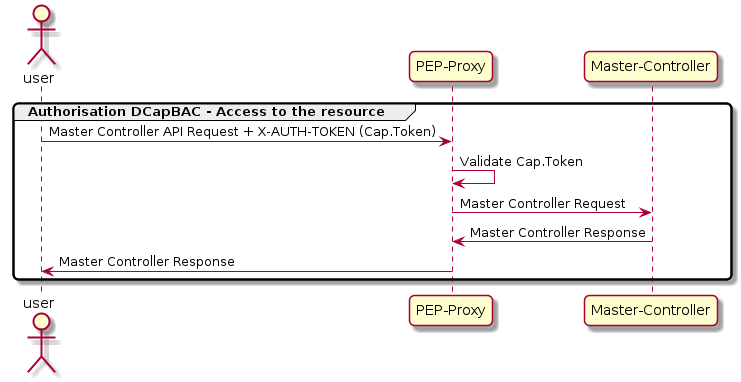

The PEP-Proxy component supports multiple `REST APIs`. It offers the same API as the component one where it forwards requests.

## Conclusions

We have the next full integration sequence of security components with our platform and more exactly over the Master-Controller component. 

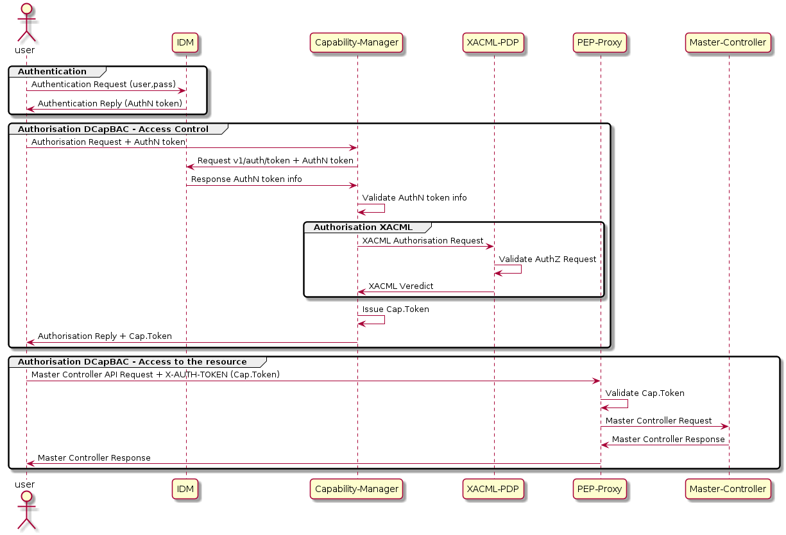

# How To Run

Security components allow be deployed using Docker or Kubernetes technologies and, this deployment can be launched in the same environment than Master-Controller component or not, anyway, with the goal of do not complicate the architecture unnecessarily, this section understands that the environment is the same one.

Regarding the configuration, two aspects will considered, on the one hand, the necessary configuration for the deployment of the components will be seen, on the other hand, the actions to be carried out on them, once deployed, will be shown to define access control. This section shows the first case.

## IdM-Keyrock

As mentioned, Keyrock\footnote{FIWARE GE Keyrock: https://fiware-idm.readthedocs.io/en/latest/index.html is a FIWARE GE responsible for the Identity Management. Keyrock installation documentation\footnote{Keyrock, installation: {https://fiware-idm.readthedocs.io/en/latest/installation_and_administration_guide/introduction/index.html} describes two ways of installing, in this sense:

- Host installation.
- Docker installation.

Anyway, installation could be done too.

Before deploying this component, the IdM-Keyrock environment variables must be considered, the official documentation\footnote{Keyrock, Environment variables: https://fiware-idm.readthedocs.io/en/latest/installation_and_administration_guide/environment_variables/index.html of this component details all the environment variables are supported by the component but, with the aim to simplify the process will be considered only these ones:

- IDM_DB_HOST: Name of the host where is running the database.
- IDM_HOST: Name of the host where is running IdM-Keyrock.
- IDM_PORT: Port where IdM-Keyrock will be running.
- IDM_DB_PASS: Password to authenticate IdM-Keyrock to perform actions against the database.
- IDM_DB_USER: Password to authenticate IdM-Keyrock to perform actions against the database.
- IDM_ADMIN_USER: Username of admin default user in IdM-Keyrock.
- IDM_ADMIN_EMAIL: Email of admin default user in IdM-Keyrock.
- IDM_ADMIN_PASS: Password of admin default user in IdM-Keyrock.
- IDM_HTTPS_ENABLED: Enable IdM-Keyrock to listen on HTTPS.
- IDM_HTTPS_PORT: Port where IdM-Keyrock will listen if HTTPS is enable.

## XACML-PAP-PDP

Before launching this component, the configuration to deploy the component must be reviewed. Optionally, this component allows enable the integration with a traceability component, for instance Blockchain, in this sense, the next environment variables must be defined:

- BlockChain_integration: To enable integration with a traceability component. Admitted values: 0-No integration, 1-With integration
- BlockChain_configuration: If enabled the traceability component integration, this variable allows to define if configuration of the traceability endpoint is defined in a configuration file or in environment variables. Admitted values: 0-Uses configuration from blockchain.conf file, 1-Uses configuration from environment variables.
- BlockChain_protocol: Protocol of the traceability component.
- BlockChain_domain: Domain included in traceability component.
- BlockChain_IP: Name of the host where is running the traceability component.
- BlockChain_port: Port where the traceability component is running.
- BlockChain_get_resource: GET resource to  obtain a domain information included in traceability component.
- BlockChain_post_resource: POST resource to register a domain in the traceability component.
- BlockChain_update_resource: POST resource to update a domain in the traceability component.

## Capability Manager

Before launching this component, the configuration to deploy the component must be reviewed. If must configure endpoints of IdM-Keyrock and PDP. Optionally, this component allows, too, enable the integration with a traceability component, for instance Blockchain. The next environment variables must be defined:

- keyrock_protocol: Protocol of the IdM-Keyrock.
- keyrock_host: Name of the host where is running the IdM-Keyrock component.
- keyrock_port: Port where the IdM-Keyrock component is running.
- keyrock_admin_email: Email of admin default user in IdM-Keyrock.
- keyrock_admin_pass: Password of admin default user in IdM-Keyrock.
- blockchain_usevalidation: To enable integration with a traceability component. Admitted values: 0-No integration, 1-With integration.
- blockchain_protocol: Protocol of the traceability component.
- blockchain_host: Name of the host where is running the traceability component.
- blockchain_port: Port where the traceability component is running.
- PDP_URL: URL offered by PDP to obtain verdict.

Additionally, create certificates to support HTTPS connections with validation, considering them in the deployment process chosen.

## PEP-Proxy

Before launching this component, the configuration to deploy the component must be reviewed. If must configure endpoints of IdM-Keyrock and PDP. Optionally, this component allows, too, enable the integration with a traceability component, for instance Blockchain. The next environment variables must be defined:

- target_protocol: Protocol of the target component endpoints (Master-Controller).
- target_host: Name of the host where is running the target component (Master-Controller).
- target_port: Port where the target component is running (Master-Controller).
- target_API: Type of API of target component (Master-Controller). In our case "Fed4IoTMC".
- blockchain_usevalidation: To enable integration with a traceability component. Admitted values: 0-No integration, 1-With integration.
- blockchain_protocol: Protocol of the traceability component.
- blockchain_host: Name of the host where is running the traceability component.
- blockchain_port: Port where the traceability component is running.
- PEP_ENDPOINT: PEP-Proxy Public address in format \verb|https://<PEP-IP>:<PEP-PORT>|.
- fed4iotmc_protocol: Protocol of the Master-Controller component endpoints (Master-Controller).
- fed4iotmc_host: Name of the host where is running the Master-Controller component.
- fed4iotmc_port: Port where the Master-Controller component is running.
- fed4iotmc_authz_testpath: : Test path of the Master-Controller component API, in order to test if PEP-Proxy has access to Master-Controller API endpoints. For instance: "/listFlavours".
- fed4iotmc_login_path: Login path of Master-Controller API. In or case: "/login".
- fed4iotmc_login_userID: User of Master-Controller component. It is required an user that has access to all endpoints that are offered to be user through PEP-Proxy.
- fed4iotmc_login_password: Password of user of Master-Controller component.
    
Additionally, create certificates to support HTTPS connections with validation, considering them in the deployment process chosen.


# Configuring and testing deployed components

As mentioned above, regarding the configuration, two aspects will considered, on the one hand, the necessary configuration for the deployment of the components will be seen, on the other hand, the actions to be carried out on them, once deployed, will be shown to define access control. This section shows the second case.

## IdM-Keyrock

The first step is to create users in this authentication component. For this goal, we need to access at IdM-Keyrok endpoint (for instance: `https://{IdM-IP}:{IdM-Port}` from a web navigator using administrator credentials defined in the deployment process.

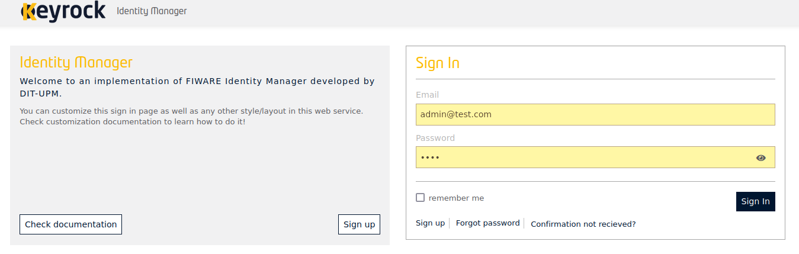

Once we are logged, we can access to Users management to define them.

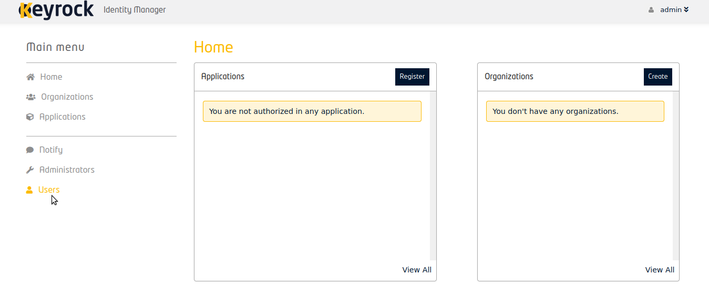

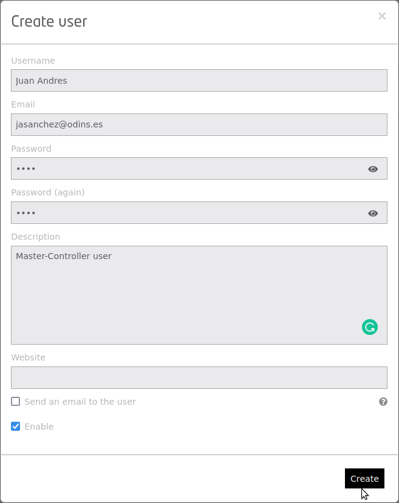
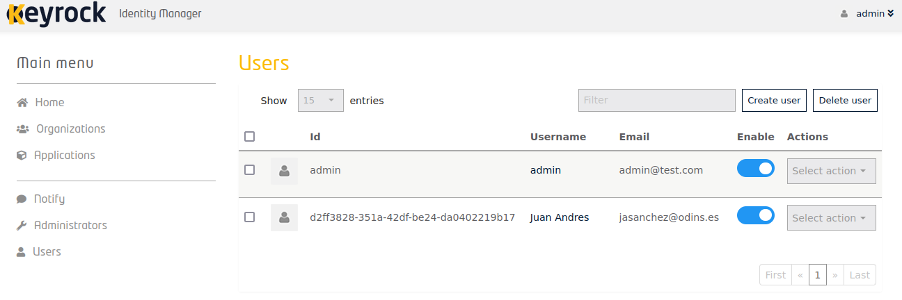

In this point, we can test that the user can authenticate through IdM-Keyrock API, in this sense, when launch, for instance:

```sh
curl --location --request POST 'https://{IdM-IP}:{IdM-Port}/v1/auth/tokens' \
--header 'Content-Type: application/json' \
--data-raw '{
  "name": "jasanchez@odins.es",
  "password": "1234"
}'
```
Replace IdM-IP and IdM-Port with the correct values. Replace XACML-PDP-IP and XACML-PDP-Port with the correct values (for instance `localhost:443`).

Obtaining the next body response (201-Created):

```sh
{
    "token": {
        "methods": [
            "password"
        ],
        "expires_at": "2021-06-23T12:02:17.676Z"
    },
    "idm_authorization_config": {
        "level": "basic",
        "authzforce": false
    }
}
```
and the authentication token in `X-Subject-Token` header response, for instance with `907ad546-3df4-4738-8b56-2a1dec486476` value.

## XACML-PAP-PDP

Once users were created in IdM-Keyrock, XACML access control policies can be defined over them.  XACML-PAP is a GUI for managing it, accessing to its endpoint (for instance: `https://{XACML-PAP-IP}:{IdM-Port}/XACML-WebPAP-2`) from a web navigator.

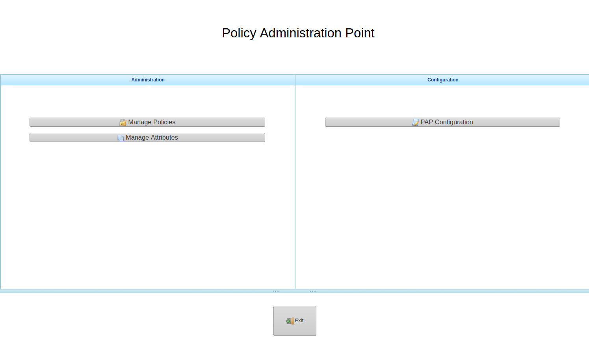

First, click the “Manage Attributes” button to define the resources, actions and subjects. In the subject’s case,  specify the Usernames you defined in IdM-Keyrock. To save click “Save All Attributes” and “Back”. In the resources box, the format of the elements is the next one `PEP-Proxy endpoint + Master-Controller's API resource`. For instance, we can see `https://localhost:1040` as the PEP-Proxy endpoint and different resources of the Master-Controller component (`/addthingVisor`, `listThingVisors`, etc...).

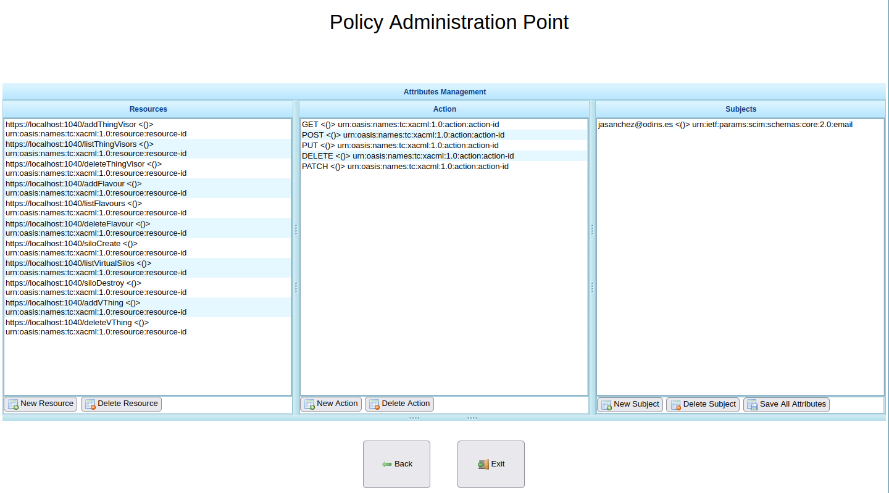

Finally, click the “Manage Policies” button to define the policies. Here,  attributes defined previously are showed. On this page, define Policies and, into them, rules. Each rule can link resources, actions and subjects and establish if this combination has a “Permit” or “Deny” verdict.

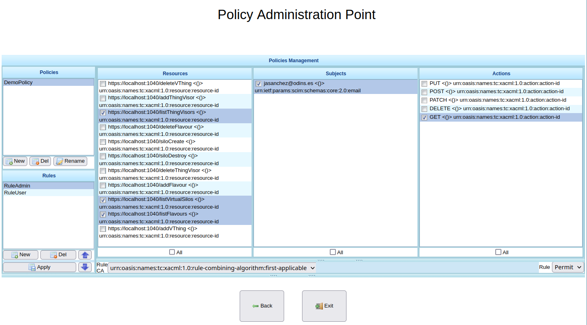

Regarding XACML-PDP we can launch this request to know if it's running, we must obtain a 200 - OK status code response:

``` sh
curl --location --request GET 'http://{XACML-PDP-IP}:{XACML-PDP-Port}/XACMLServletPDP'
```
Replace XACML-PDP-IP and XACML-PDP-Port with the correct values (for instance `localhost:8080`).

## Capability Manager

Regarding configuration there is nothing to do with this component, anyway, we can launch this request to know if it's running, we must obtain a 200 - OK status code response:

``` sh
curl --location --request GET 'https://{CapMan-IP}:{CapMan-Port}/
```
Replace CapMan-IP and CapMan-Port by the correct values.

Following the current example, can send the next sentence:

```sh
  curl --location --request POST 'https://localhost:3040' \
--header 'Content-Type: application/json' \
--data-raw '{"token": "907ad546-3df4-4738-8b56-2a1dec486476","ac": "GET", "de": "https://localhost:1040", "re": "/listThingVisors"}'
```

Obtaining 200-OK response with the next Capability Token:
```
{"id": "va6t2r5qet9p85tt3sf73ihcje", "ii": 1624449195, "is": "capabilitymanager@odins.es", "su": "jasanchez@odins.es", "de": "https://localhost:1040", "si": "MEYCIQC7vXKpBaLd3N0jw5Sn1BLvVDGtLfeZQn0db3Ub9ZSInQIhAPY7CTDNpZVf8kLOOU7tRGEuFjXNKsxpWLvCs1NG4mO+", "ar": [{"ac": "GET", "re": "/listThingVisors"}], "nb": 1624450195, "na": 1624460195}
```

## PEP-Proxy

Regarding configuration there is nothing to do with this component, anyway, we can launch this request to know if it's running, we must obtain a 200 - OK status code response:

``` sh
curl --location --request GET 'https://{PEP-Proxy-IP}:{PEP-Proxy-Port}/
```
Replace PEP-Proxy-IP and PEP-Proxy-Port by the correct values.


Following the current example, can send the next sentence:

```
curl --location --request GET 'https://localhost:1040/listThingVisors' \
--header 'Accept: application/json' \
--header 'x-auth-token: {"id": "va6t2r5qet9p85tt3sf73ihcje", "ii": 1624449195, "is": "capabilitymanager@odins.es", "su": "jasanchez@odins.es", "de": "https://localhost:1040", "si": "MEYCIQC7vXKpBaLd3N0jw5Sn1BLvVDGtLfeZQn0db3Ub9ZSInQIhAPY7CTDNpZVf8kLOOU7tRGEuFjXNKsxpWLvCs1NG4mO+", "ar": [{"ac": "GET", "re": "/listThingVisors"}], "nb": 1624450195, "na": 1624460195}'
```

Obtaining the response from Master-Controller API througth PEP-Proxy.
