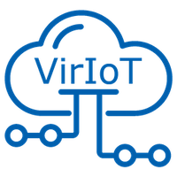

  
# VirIoT

These are the instructions to quickly setup an instance of the VirIoT platform being developed
by the [Fed4IoT](https://fed4iot.org) EU-Japan project.

The VirIoT platform enables virtualization of IoT systems, formed by VirtualThings and brokers. 
That allows owners of IoT infrastructures to share them with many IoT application developers, 
which can simply rent the VirtualThings and the brokers their applications need.

The setup of this demo configuration was tested on Ubuntu 18.04. It's divided into two parts:  
1. Initial configuration, it's possible to setup the configuration either on Docker or Kubernetes. 
    * [Docker Deployment](Doc/Docker%20Depolyment.md): to setup the Docker based implementation.
    * [Kubernetes Deployment](Doc/Kubernetes%20Deployment.md): to setup the Kubernetes based implementation.
2. [CLI Usage Example](Doc/CLI%20Usage%20Example.md): shows the CLI usage.
