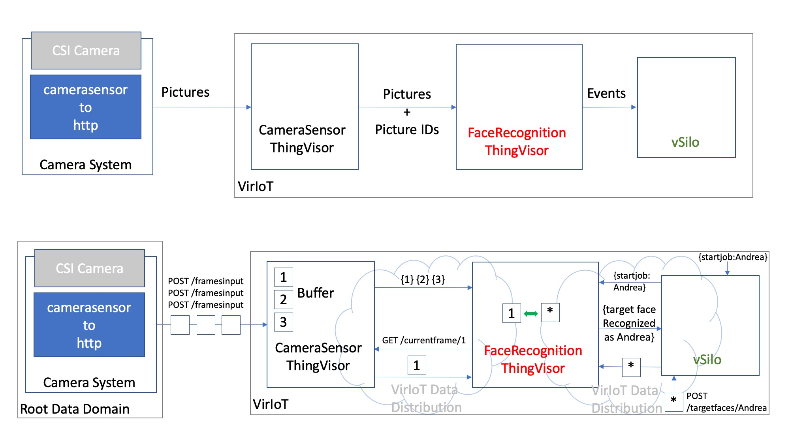

# FaceRecognition ThingVisor

This ThingVisor allows to do face recognition with a camera system, and to virtualize the camera system as a single face recognition device.

## How it works

The following picture shows the face recognition architecture, which comprises the Camera System, the CameraSensor ThingVisor and the FaceRecognition ThingVisor.



Overall, the Camera System sends to the CameraSensor TV every new video frame it captures from the Camera. The CameraSensor TV buffers the video frames and gives them unique identifiers. Whenever the FaceRecognition TV is ready to process a new video frame, it gets it by name, asking it to the CameraSensor TV. The FaceRecognition TV processes the frame by comparing it to a target picture of a person. If a match is found, an event is sent from the FaceRecognition TV to a vSilo (that hosts the IoT Broker and talk to an external Application).

More specifically:

### The Camera System

- Connects to a CSI (Camera Serial Interface) Camera. The current implementation uses CV2 to capture video from a camera attached to a Jetson Nano board. 
- Undistorts, compresses to jpeg, and scales down each video frame.
- Sends each new video frame to the CameraSensor TV via HTTP POST.

The Camera System is currently implemented as a python script responsible for compression and HTTP communication, which is called [camerasensor-to-http.py](../ThingVisor_CameraSensor/jetbot_scripts/camerasensor-to-http.py). It imports a python module, which is responsible for video capture, and is called [camera_mod.py](../ThingVisor_CameraSensor/jetbot_scripts/camera_mod.py). Both can be found in the scripts folder of the CameraSensor TV.

### The CameraSensor ThingVisor
- Offers a REST interface to receive video frames, via HTTP POST.

  The interface is called ``/framesinput`` and accepts multipart POST requests composed of 2 parts:
  - a part named ``file`` that is a jpeg file representing the current video frame
  - a part named ``json`` that is a json file representing the timestamp when the video frame was captured, in the following form: ``{"observedAt":STRING}``

  The REST API lives at ip port 5000, so if, for instance, <CAMERASENSORTV_PUBLIC_IP> is the public ip address to reach the CameraSensor TV and <PORT_MAPPED_TO_5000> is the external port mapped onto internal port 5000, the following ``echo`` and ``curl`` command sequence is an example to POST a new video frame:
  ```bash
  $ echo {\"observedAt\":\"02-02-2021 14:34\"} > metadata.json
  $ curl -F "file=@currentframe.jpg" -F "json=@metadata.json" http://<CAMERASENSORTV_PUBLIC_IP>:<PORT_MAPPED_TO_5000>/framesinput
  ```
- Buffers a certain (configurabile) amount of video frames, FIFO style, and it gives unique identifiers to them, upon arrival of each new frame.

  The default size of the video buffer is 20, and it holds the jpeg compressed pictures in memory.
  
  The size of the buffer is a configurabile parameter of the ThingVisor. It can be specified at creation time, when the TV is added to VirIoT, as in the following example, where a TV is added using the yaml that specifies a CameraSensor, the name "camerasensor-tv" is given to it, and the "buffersize" parameter is set to 30.

  ```bash
  $ f4i.py add-thingvisor -y ../yaml/thingVisor-cameraSensor-http.yaml -n camerasensor-tv -d "camera frames via http" -p '{"buffersize":30}' -z default
  ```

  Alternatively, by using the update-thingvisor VirIoT command on a running TV, the "buffersize" parameter can be changed in real-time, as follows:

  ```bash
  $ f4i.py update-thingvisor -n camerasensor-tv -p '{"buffersize":40}'
  ```

- Emits an event, representing context information about the video frame, in the form of a NGSI-LD Entity containing the picture's identifier, upon arrival of each new frame.

  The NGSI-LD Entity emitted at each frame arrival is in "neutral format", as follows (assuming the ThingVisor's name is "camerasensor-tv"): each event/entity is of type "NewFrameEvent" and it has just one Property, named "frameIdentifier". The information about the timestamp of the video frame is dropped, as of now, since it is not needed for face recognition purposes.
  ```
  {
    id : urn:ngsi-ld:camerasensor-tv:sensor
    type : NewFrameEvent
    frameIdentifier : {
      type : Property
      value : "1623229264110-0"
    }
  }
  ```

- Offers a REST interface to fetch a specific frame by its identier, via HTTP GET.

  The interface is called ```/currentframe/<randomid>``` and accepts GET HTTP requests. It gives back data with mime-type "image/jpeg".

  The following ``curl`` command is an example to GET video frame by its id:
  ```bash
  $ curl --output videoframe.jpg http://<CAMERASENSORTV_PUBLIC_IP>:<PORT_MAPPED_TO_5000>/currentframe/1623229264110-0
  ```